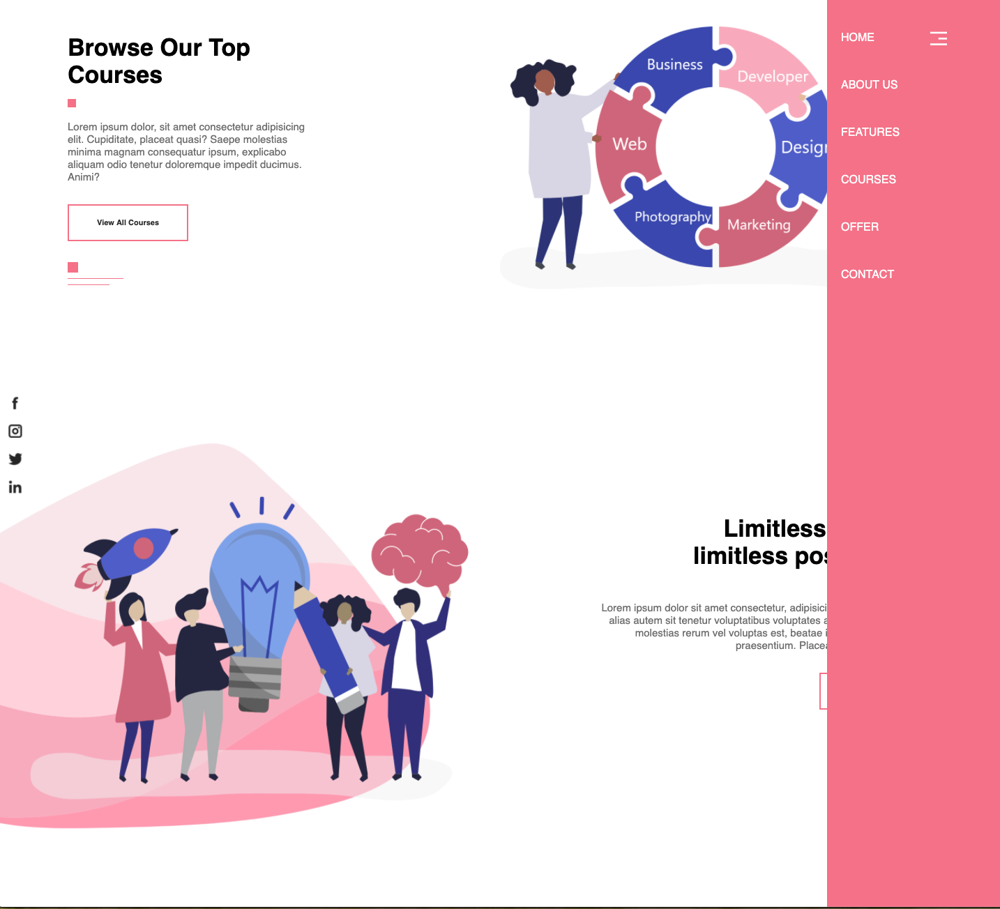

# Website for an imaginary teaching company

A website for a teaching company. Using smooth scroll for the navigation.

- Smooth scroll [https://github.com/cferdinandi/smooth-scroll]

Media queries have been added for 700px max-width.

## Screenshots

Image 1

Image 2

Image 3

## Author

- Albert Stjärne (https://github.com/AlbertStjarne)
